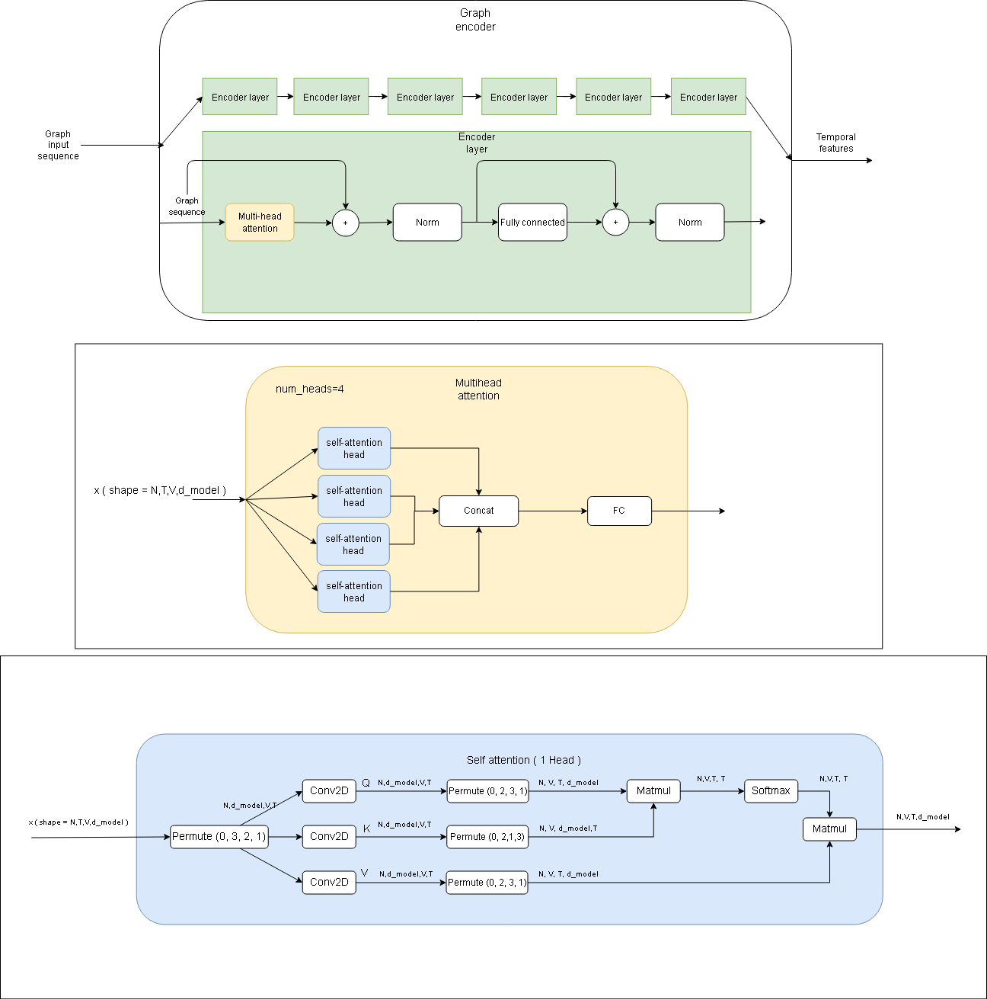

# Transformer and GCN for 3d Skeleton based hand gesture recognition

## Model architecture :

  

<!-- 

  

 -->
<!--  -->

## Datasets 
#### 1. SHREC'17 : 

SHREC'17 is a challenging hand gesture dataset. It contains 2 configurations:  14 gestures performed using one finger and 28 gestures performed with the full hand. Each gesture is performed between 1 and 10 times by 28 participants, which gives us, 2800 sequences in total. In the experiments, this data is divided into a 70/30 split, 1960 sequences for training and 840 sequences for testing.
Link : http://www-rech.telecom-lille.fr/shrec2017-hand/

#### 2. First-Person Hand Action Benchmark with RGB-D Videos and 3D Hand Pose Annotation : 

The First Person Hand Action dataset provides dynamic hand action sequences of subjects performing daily life tasks. It contains, 45 different actions performed by 6 actors manipulating 26 objects in 3 scenarios. In total 1175 action samples. We use the 1:1 data split ratio proposed in the original paper, with 600 action sequences used for training and 575 for testing.
Link: https://guiggh.github.io/publications/first-person-hands/

#### 3. Briareo : 

was released in 2019 for the task of dynamic hand gesture recognition in an automotive context. This dataset was mainly collected for applications that aim to reduce driver inattention.
The dataset contains 12 gestures performed by 40 different subjects (33 males and 7
females) with the right hand, with each gesture is repeated three times. The entire dataset contains 1440 sequences with subjects from 1 to 26 used for training, 27 to 32 used for validation and 33 to 40 used for testing.
Link: https://aimagelab.ing.unimore.it/imagelab/page.asp?IdPage=31

<!-- ## Presentations slides :
<ul>  
<li> Presentation of meeting on 07/03 : https://docs.google.com/presentation/d/15yNmMs_09LldK1JBAy16deuIcKAqGVUHOafnQv9ihWI/edit?usp=sharing</li>
<li> Presentation of meeting on 14/03 : https://docs.google.com/presentation/d/1LLv1dLM2l2pikQH3SHK9g1Nc07yEwwqgWf4xUFUYQsU/edit?usp=sharing</li>
<li> Presentation of meeting on 21/03 : https://docs.google.com/presentation/d/1Prfb0hRRiyn070CUb1GccUywJe4p_RMEci7ONILvoNQ/edit?usp=sharing</li>
<li> Presentation of meeting on 25/03 : https://docs.google.com/presentation/d/1PCxnYu9gO_dNBvS2cK08btXbrdcBFmSnqAYQ-QhOBYs/edit?usp=sharing</li>
<li> Presentation of meeting on 04/04 + 19/04 : https://docs.google.com/presentation/d/1NDFdC4tPsoH9OjtlVaOl4ga03LCiKp9EAIXWaAo7RzE/edit?usp=sharing</li>
</ul> -->

<!-- ## Results :

 
 Results files :  https://docs.google.com/document/d/1yGWuePKTz5JzXVRk9Y_UZe1aaNoPh7gIsfuPPYWFm-4/edit?usp=sharing 
 
 
 Results sheet : https://docs.google.com/spreadsheets/d/1biXAyx_3Ry1459x5qWA1oYE89o41GDI93srR4uoWzlo/edit?usp=sharing 
   -->

## Important papers :

Consulted papers :https://docs.google.com/document/d/1KAJw1JTYK0k9C_YLx3FsxGrxViQxppKrRSePDeLr1Qw/edit?usp=sharing

> A Transformer-Based Network for Dynamic Hand Gesture Recognition ( https://iris.unimore.it/retrieve/handle/11380/1212263/282584/3DV_2020.pdf ) ( 2020 International Conference on 3D Vision (3DV) )

> Attention is all you need ( https://arxiv.org/abs/1706.0376 ) ( NIPS 2017  )

> Semi-Supervised Classification with Graph Convolutional Networks ( Original GCN paper )( https://arxiv.org/abs/1609.02907 ) ( ICLR 2017  )
