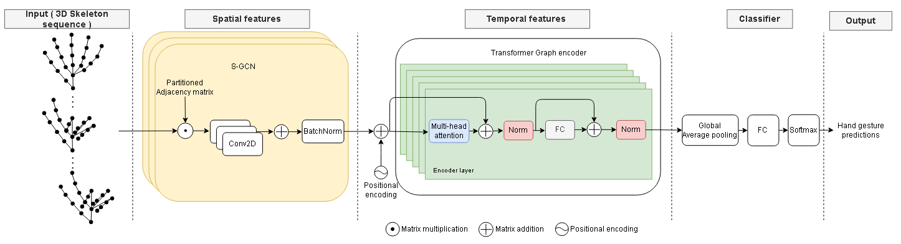

# Transformer and GCN for 3d Skeleton based hand gesture recognition

## Model architecture :

  

  

<!--  -->

## Datasets 
### 1. Offline datasets :
#### 1. DHG-14/28 : 

The Dynamic Hand gesture 14/28 dataset contains sequences of 14 hand gestures performed in two ways: using one finger and the whole hand. Each gesture is performed 5 times by 20 participants in 2 ways - described above - , resulting in 2800 sequences. All participants are right handed. Sequences are labelled following their gesture, the number of fingers used, the performer and the trial. Each frame of sequences contains a depth image, the coordinates of 22 joints both in the 2D depth image space and in the 3D world space forming a full hand skeleton. The Intel RealSense short range depth camera is used to collect our dataset. The depth images and hand skeletons were captured at 30 frames per second, with a resolution of the depth image of 640x480. The length of sample gestures ranges from 20 to 50 frames. http://www-rech.telecom-lille.fr/DHGdataset/ 

#### 2. First-Person Hand Action Benchmark with RGB-D Videos and 3D Hand Pose Annotation : 

The dataset was collected using a mo-cap system that automatically infers the 3D location of each of the 21 joints of a hand model via 6 magnetic sensors and inverse kinematics, RGB-D video sequences comprised of more than 100K frames of 45 daily hand action categories, involving 26 different objects in several hand configurations, Additionally, 6D object poses were recorded and 3D object models for a subset of hand-object interaction sequences were provided. https://guiggh.github.io/publications/first-person-hands/

## Presentations slides :
<ul>  
<li> Presentation of meeting on 07/03 : https://docs.google.com/presentation/d/15yNmMs_09LldK1JBAy16deuIcKAqGVUHOafnQv9ihWI/edit?usp=sharing</li>
<li> Presentation of meeting on 14/03 : https://docs.google.com/presentation/d/1LLv1dLM2l2pikQH3SHK9g1Nc07yEwwqgWf4xUFUYQsU/edit?usp=sharing</li>
<li> Presentation of meeting on 21/03 : https://docs.google.com/presentation/d/1Prfb0hRRiyn070CUb1GccUywJe4p_RMEci7ONILvoNQ/edit?usp=sharing</li>
<li> Presentation of meeting on 25/03 : https://docs.google.com/presentation/d/1PCxnYu9gO_dNBvS2cK08btXbrdcBFmSnqAYQ-QhOBYs/edit?usp=sharing</li>
<li> Presentation of meeting on 04/04 + 19/04 : https://docs.google.com/presentation/d/1NDFdC4tPsoH9OjtlVaOl4ga03LCiKp9EAIXWaAo7RzE/edit?usp=sharing</li>
</ul>

## Important papers :

> A Transformer-Based Network for Dynamic Hand Gesture Recognition ( https://iris.unimore.it/retrieve/handle/11380/1212263/282584/3DV_2020.pdf ) ( 2020 International Conference on 3D Vision (3DV) )

> Attention is all you need ( https://arxiv.org/abs/1706.0376 ) ( NIPS 2017  )

> Semi-Supervised Classification with Graph Convolutional Networks ( Original GCN paper )( https://arxiv.org/abs/1609.02907 ) ( ICLR 2017  )
